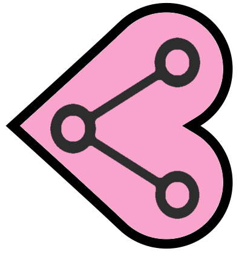

# Patient Data Network



_A secure and transparent network for sharing health data_

The Patient Data Network is a project that enables people to access and share their health data between people, healthcare professionals and healthcare practitioners. It is built on the _[Hyperledger Blockchain Fabric](https://www.hyperledger.org)_ and uses _[HL7 FHIR](https://www.hl7.org/fhir/)_ resources.

The network consists of three categories;

### Participants
* Patients 
* Individual Healthcare Practitioners (doctors, dentists, physiotherapists, chiropractors etc.)
* Healthcare Organizations (Hospitals, research organizations, insurers)

### Assets
* Procedure
* Imaging Study
* Medication
* ...
* ...

### Transaction
* Consent to share data assets


In FHIR, we have an Audit resource, but that is implicit in the blockchain transactions. The data doesn't live on the blockchain, but instead the blockchain holds a link to the resource which is stored at the healthcare organization. We also store a hash of the data ensuring that the data is not tampered with.

Please check our project Wiki page for details on how to contribute...

***

## Building the network

To build the project, you must follow the installation instructions given on the [Hyperledger Fabric Installation guide](https://hyperledger.github.io/composer/v0.19/installing/installing-index).

Here are the specific versions of software that were used to build this project:

### Node
Node installation was performed using [NVM](https://github.com/creationix/nvm) (Node Version Manager)
```
$ nvm --version
0.33.0
```
We are using the LTS version of Node
```
$ nvm current
v8.12.0
```
### Docker

```
$ docker --version
Docker version 18.06.1-ce, build e68fc7a215

```
### Microsoft Visual Code
```
$ code --version
1.27.2

```
After installation, we installed the Hypledger CTO plugin.

### Hyperledger Composer

```
$ composer --version
v0.20.0
```
## Running the application

* Ensure that docker is running. `docker ps`
* Set the environmental variables
    * The `$FABRIC_VERSION`, which I am using hlfv12 
    * The location of the Fabric Dev Servers with the variable `$FABRIC_DEV_SERVERS`
* Run the script file to start the network
    ```
    $./startNetwork.sh <version#>
    ```
    The ```<version#>``` must be the version number that appears in the [`package.json`](package.json) file 
* Run `composer-playground` from the terminal
* Open [http://localhost:8080](http://localhost:8080) in your browser of choice
* At the bottom of the `admin@patient-data-network` card, you can click on the _"Connect now"_ link
* Now you are up and running, feel free to play around by switching your ID in the ID Registry between patients and practitioners..
* Feedback and contributions are welcome

---

## Acknowledgements
Thank you to the Hyperledger Project and HL7 FHIR creators and contributors, without whom this project would not exist.

## Creator
[Mick Lynch](https://mlynch.redbrick.dcu.ie) is an engineer PhD who loves translating ideas into novel products that have a real impact. He has been working in health IT, software development and team management since 2006.
